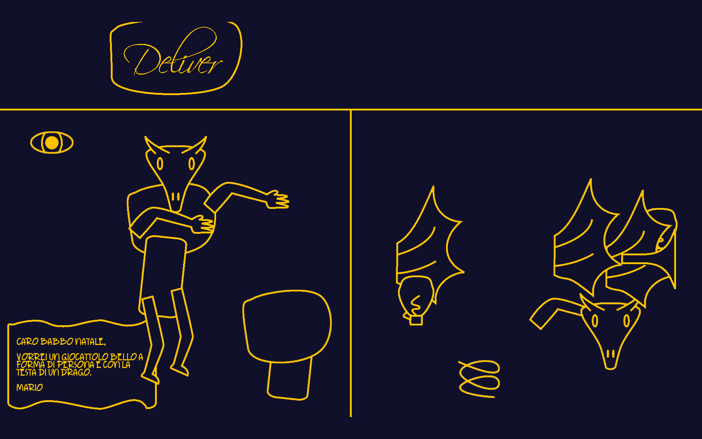

# Santa Claus's Last Helper
(L'ultimo aiutante di Babbo Natale)

This game was developed for the 2024 Secret Santa game jam, using Python3 libraries `desper` and `pyglet`.

Become one of Santa's helpers, and build gifts for children around the world. What could go wrong?

The game is currently **only available in Italian**.



## Requirements
The project was developed and tested on Python 3.11 and 3.12. It should be working on any Python version >= 3.10.

All required python libraries are listed in `requirements.txt`. To install them:
```bash
pip install -r requirements.txt
```
Consider using a virtual environment.

## Running
The game can be run directly after installing the requirements:
```bash
# Include -OO to run without debugging
# On Windows, you may need to replace "python" with "py"
python -OO main.py
```
Alternatively, or in case you want to distribute the game, consider building an executable.

## Building
The game can easily be built on Linux and Windows. Apple platforms are in theory compatible, but may require tweaking the resources. Building happens through `cx_freeze`.

Install `cx_freeze`:
```bash
pip install cx_freeze
```

Then build:
```bash
# On Windows, you may need to replace "python" with "py"
python cx_setup.py build
```

If the build is successful, a new folder `build` is created, which contains the newly built game folder.

## How to play
The game requires a mouse to be played. Since clicking both mouse buttons at the same time is required, touchpads may not be suitable. The game explains game controls explicitly, but here is a summary.

Commands:
* `F`: toggle fullscreen
* `ESC`: quit
* `Left click + drag`: pickup and move items
* `Right click + drag`: detach an item and move it
* While dragging, `Right + Left click`: Attach an item

## Code structure overview
The code architecture follows an ECS-like structure, implemented by the [desper](https://github.com/Ball-Man/desper) package. Graphics capabilities are provided by the [pyglet](https://github.com/pyglet/pyglet) multimedia library. The main storyline has been designed using radmatt's [Dialogue Designer](https://radmatt.itch.io/dialogue-designer). I built a simplified decoder library called [python-ddesigner](https://github.com/Ball-Man/python-ddesigner).


## Licenses
Artworks, entirely made by me, are public domain, in particular:
<p xmlns:cc="http://creativecommons.org/ns#" xmlns:dct="http://purl.org/dc/terms/"><a property="dct:title" rel="cc:attributionURL" href="https://github.com/Ball-Man/last-santa-helper/tree/master/resources/image">"Santa Claus's Last Helper"'s artworks</a> by <a rel="cc:attributionURL dct:creator" property="cc:attributionName" href="https://www.fmistri.it/">Francesco Mistri</a> is marked with <a href="https://creativecommons.org/publicdomain/zero/1.0/?ref=chooser-v1" target="_blank" rel="license noopener noreferrer" style="display:inline-block;">CC0 1.0</a></p>


Sound effects were found on Freesound, please find the attributions in `sfx_credits.txt`. Check the licenses before redistributing for your own purposes.

Fonts have public-domain/very permissive licenses (soon to be attributed).

Every other piece of data/code in teh repository is under the MIT license (see `LICENSE`)
